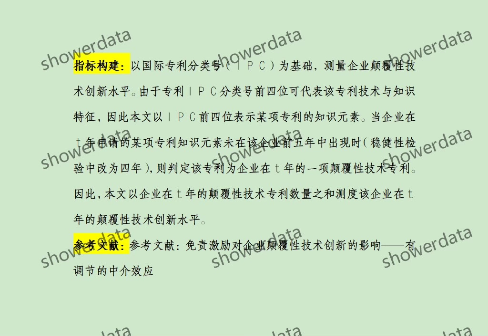
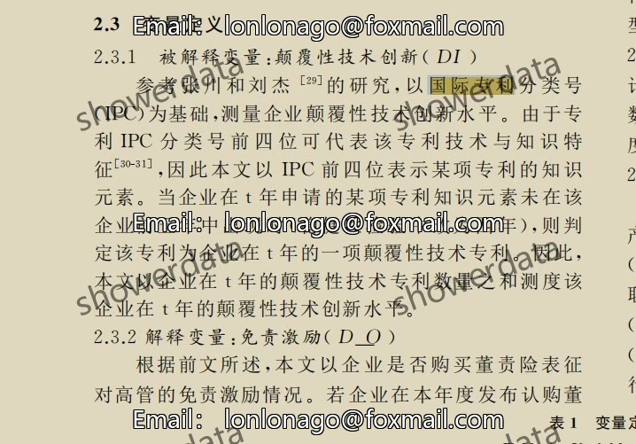
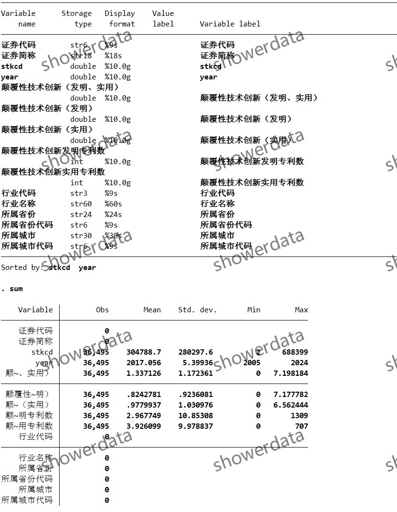
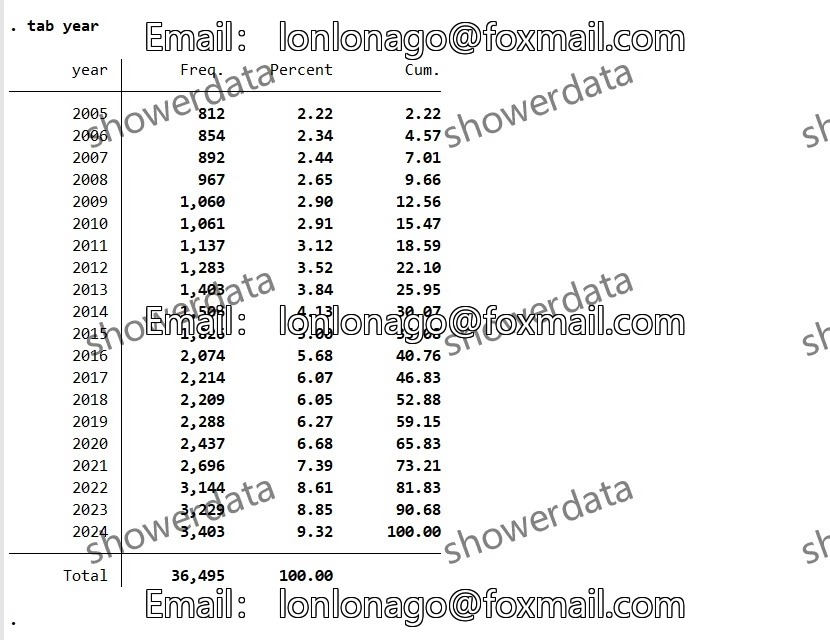
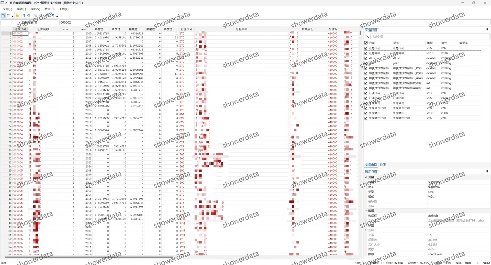
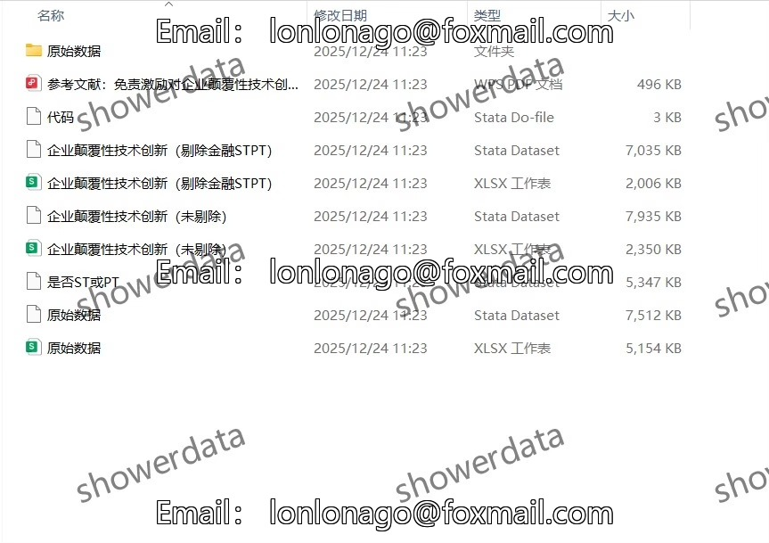

## Body

（2005-2024年）上市公司-企业颠覆性技术创新

一、数据介绍
（1）数据详情：见下方图片，拍前请看清楚！已完整展示说明，请确定好是不是自己需要的再拍下！发货后任何理由不退不换！
（2）数据名称：上市公司-企业颠覆性技术创新
（3）样本范围：hu深鼓尚视公司（可自行修改代码获得全部A上市公司）
，未剔除4.1w+条观测值；剔除后3.6w+条观测值,展示结果为已剔除
（4）时间范围：2005-2024年
（5）结果数据格式：excel、dta
（6）数据内容：结果（两个版本未缩尾未剔除、已剔除未缩尾）、参考文献、原始数据、代码 
（7）原始数据来源：巨、潮、资、讯、网

二、数据结果指标如图所示

三、计算方法如图所示

四、参考文献如图所示

## Images

item_1005211263802

Here is a pay link on Stripe ( https://buy.stripe.com/3cs8yP7sY87d0vu9AB ). Please contact me lonlonago@foxmail.com after funding $89, and I will send you a complete data files , thank you!

